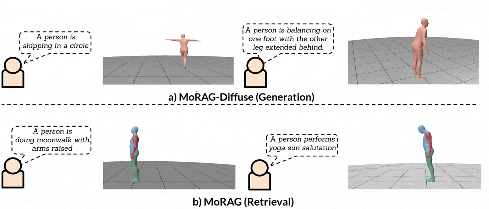

<div align="center">

# MoRAG - Multi-Fusion Retrieval Augmented Generation for Human Motion


<a href="https://www.linkedin.com/in/sai-shashank-54288219b"><strong>Sai Shashank Kalakonda</strong></a>
·
<a href="https://shubhmaheshwari.github.io/"><strong>Shubh Maheshwari</strong></a>
·
<a href="https://ravika.github.io/"><strong>Ravi Kiran Sarvadevabhatla</strong></a>


[](https://wacv2025.thecvf.com/)
[](https://arxiv.org/abs/2409.12140)
[]()

  <a href="">
    
  </a>

</div>

## Description

Please visit our [**webpage**](https://motion-rag.github.io/) for more details.

### Bibtex
If you find this code useful in your research, please cite:

```bibtex
@InProceedings{MoRAG,
    title     = {MoRAG - Multi-Fusion Retrieval Augmented Generation for Human Motion},
    author    = {Kalakonda, Sai Shashank and Maheshwari, Shubh and Sarvadevabhatla, Ravi Kiran},
    booktitle = {Proceedings of the IEEE/CVF Winter Conference on Applications of Computer Vision ({WACV})},
    year      = 2025
}
```

You can also put a star :star:, if the code is useful to you.

## Contents
- This work comprises two components: **MoRAG** and **MoRAG-Diffuse**.  
- Separate folders are provided for each, along with their respective README files.  
- Refer to these README files for detailed information.